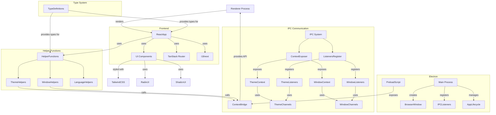

# Runebar 项目架构

## 架构概览 UML 图



## 架构解释

Runebar 是一个基于 Electron 的桌面应用程序，采用了模块化的架构设计，主要由以下几个核心部分组成：

### 1. Electron 进程

- **Main Process（主进程）**：应用程序的入口点，负责创建窗口、管理应用生命周期和处理系统级操作。
- **Renderer Process（渲染进程）**：负责 UI 渲染，运行 React 应用程序。
- **Preload Script（预加载脚本）**：在渲染进程启动前运行，建立主进程和渲染进程之间的安全通信桥梁。

### 2. IPC 通信系统

采用了分层的模块化设计，确保主进程和渲染进程之间的安全通信：

- **中央协调器**：
  - `context-exposer.ts`：在预加载脚本中暴露所有上下文
  - `listeners-register.ts`：在主进程中注册所有事件监听器

- **功能模块**：每个模块包含三个关键文件：
  - `{module}-channels.ts`：定义 IPC 通道常量
  - `{module}-context.ts`：暴露渲染进程可访问的 API
  - `{module}-listeners.ts`：在主进程中处理渲染进程的请求

- **现有模块**：
  - 主题管理模块：控制应用程序主题
  - 窗口控制模块：控制应用程序窗口

### 3. 前端框架

- **React**：用于构建用户界面
- **TanStack Router**：处理应用程序路由
- **i18next**：提供国际化和本地化支持

### 4. UI 组件库

- **shadcn/ui**：基于 Radix UI 原语构建的组件库
- **Radix UI**：提供无障碍、无样式的 UI 原语
- **Tailwind CSS**：用于样式设计的实用优先 CSS 框架

### 5. 辅助函数

- **theme_helpers.ts**：管理应用程序主题
- **window_helpers.ts**：提供窗口控制功能
- **language_helpers.ts**：管理应用程序语言设置

## 扩展功能指南

### 添加新的 IPC 功能模块

1. **创建模块文件结构**：
   ```
   src/helpers/ipc/{module}/
   ├── {module}-channels.ts    # 定义 IPC 通道常量
   ├── {module}-context.ts     # 暴露渲染进程可访问的 API
   └── {module}-listeners.ts   # 在主进程中处理渲染进程的请求
   ```

2. **定义通道常量**：在 `{module}-channels.ts` 中定义所有需要的 IPC 通道名称。

3. **实现上下文暴露**：在 `{module}-context.ts` 中创建暴露函数，使用 contextBridge 将 API 暴露给渲染进程。

4. **实现事件监听器**：在 `{module}-listeners.ts` 中创建函数来处理渲染进程的请求。

5. **集成到中央协调器**：
   - 在 `context-exposer.ts` 中导入并调用上下文暴露函数
   - 在 `listeners-register.ts` 中导入并调用事件监听器注册函数

6. **创建辅助函数**：在 `src/helpers/{module}_helpers.ts` 中提供简化的接口，封装对 IPC API 的调用。

### 添加新的 UI 组件

1. **遵循现有组件结构**：
   - 使用 `cva` 定义样式变体
   - 使用 TypeScript 接口扩展 HTML 元素属性和变体属性
   - 使用 `React.forwardRef` 进行引用转发
   - 使用 `asChild` 属性和 Radix UI 的 `Slot` 实现组件组合

2. **保持样式一致性**：
   - 使用 Tailwind CSS 进行样式设计
   - 遵循项目的颜色主题和设计语言
   - 确保组件支持深色模式

3. **确保无障碍性**：
   - 提供适当的 ARIA 属性
   - 确保键盘导航支持
   - 支持屏幕阅读器

### 添加新的国际化语言

1. **在 i18next 中添加新的语言资源**。

2. **使用 `language_helpers.ts` 中的函数来切换和管理语言设置**。

## 开发工具指南

### 推荐的开发工具

1. **代码编辑器**：
   - Visual Studio Code 配合 Electron 和 React 相关扩展

2. **开发调试**：
   - Electron DevTools 扩展（已在项目中配置）
   - React Developer Tools（已在项目中配置）

3. **状态管理**：
   - 对于简单状态，使用 React 的 Context API 和 hooks
   - 对于复杂状态，考虑添加 Zustand 或 Jotai

4. **测试工具**：
   - Vitest 用于单元测试（已在项目中配置）
   - Playwright 用于端到端测试（已在项目中配置）

5. **代码质量工具**：
   - Biome 用于代码格式化和 linting（已在项目中配置）
   - husky 用于 Git hooks（已在项目中配置）

### 开发流程

1. **启动开发服务器**：
   ```bash
   npm run dev
   ```

2. **构建应用程序**：
   ```bash
   npm run build
   ```

3. **打包应用程序**：
   ```bash
   npm run package
   ```

4. **运行测试**：
   ```bash
   # 运行单元测试
   npm run test:unit
   
   # 运行端到端测试
   npm run test:e2e
   ```

## 最佳实践

1. **遵循模块化设计**：将功能分解为独立的模块，每个模块负责特定的功能。

2. **使用 TypeScript 类型**：确保代码的类型安全，减少运行时错误。

3. **安全的 IPC 通信**：始终使用 contextBridge 和 IPC 通道进行进程间通信，避免直接暴露 Electron API。

4. **组件复用**：尽可能复用现有组件，保持 UI 的一致性。

5. **性能优化**：
   - 使用 React.memo 和 useMemo/useCallback 减少不必要的重渲染
   - 懒加载路由和组件
   - 优化 Electron 的启动时间和资源使用

6. **错误处理**：实现全局错误边界和日志记录系统，确保用户体验不会因错误而中断。

7. **自动化测试**：为关键功能编写测试，确保代码质量和稳定性。 