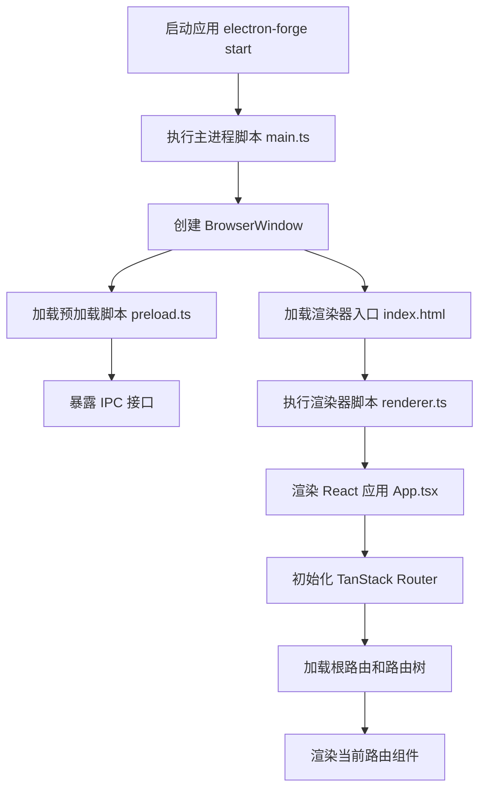
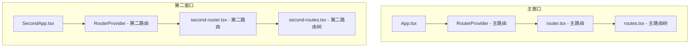

# Electron 应用启动流程

本文档详细说明了 Electron 应用的启动流程，特别是 Electron 主进程、预加载脚本和渲染进程之间的交互，以及 TanStack Router 在渲染进程中的作用。

## 基本流程

Electron 应用的启动流程如下：



## 详细说明

### 1. 主进程 (Main Process)

主进程是 Electron 应用的入口点，负责创建窗口、管理应用生命周期和处理系统级事件。

```typescript
// main.ts
import { app, BrowserWindow } from 'electron';
import path from 'node:path';

function createWindow() {
  // 创建浏览器窗口
  const mainWindow = new BrowserWindow({
    width: 800,
    height: 600,
    webPreferences: {
      preload: path.join(__dirname, 'preload.js'),
      contextIsolation: true,
      nodeIntegration: true,
    },
  });

  // 加载渲染器入口点
  mainWindow.loadURL('file://' + path.join(__dirname, 'index.html'));
}

// 当 Electron 完成初始化时创建窗口
app.whenReady().then(() => {
  createWindow();
});
```

主进程启动顺序：
1. 应用初始化
2. 创建 BrowserWindow 实例
3. 注册事件监听器
4. 加载预加载脚本
5. 加载渲染器入口点

### 2. 预加载脚本 (Preload Script)

预加载脚本在渲染器进程启动之前执行，可以访问 Node.js 和 Electron API，用于安全地暴露功能给渲染器进程。

```typescript
// preload.ts
import { contextBridge, ipcRenderer } from 'electron';

// 暴露安全的 API 给渲染器进程
contextBridge.exposeInMainWorld('electronWindow', {
  minimize: () => ipcRenderer.invoke('window:minimize'),
  maximize: () => ipcRenderer.invoke('window:maximize'),
  close: () => ipcRenderer.invoke('window:close'),
});
```

预加载脚本的作用：
1. 创建渲染器进程和主进程之间的安全通信桥接
2. 暴露受限的 API 给渲染器进程
3. 确保上下文隔离，防止安全问题

### 3. 渲染器进程 (Renderer Process)

渲染器进程负责 UI 渲染和用户交互，在我们的应用中使用 React 和 TanStack Router。

```typescript
// App.tsx
import React, { useEffect } from 'react';
import { createRoot } from 'react-dom/client';
import { RouterProvider } from '@tanstack/react-router';
import { router } from './routes/router';

function App() {
  // 初始化应用设置
  useEffect(() => {
    // 例如：同步主题、语言等
  }, []);

  // 渲染路由系统
  return <RouterProvider router={router} />;
}

// 将应用挂载到 DOM
const root = createRoot(document.getElementById('app')!);
root.render(
  <React.StrictMode>
    <App />
  </React.StrictMode>
);
```

渲染器进程启动顺序：
1. 加载 HTML 入口点
2. 执行渲染器脚本
3. 创建 React 应用实例
4. 初始化 TanStack Router
5. 渲染当前路由组件

### 4. TanStack Router 的工作原理

TanStack Router 是一个类型安全的路由库，在我们的应用中使用内存历史 (Memory History) 模式。

```typescript
// router.tsx
import { createMemoryHistory, createRouter } from '@tanstack/react-router';
import { rootTree } from './routes';

// 创建内存历史
const history = createMemoryHistory({
  initialEntries: ['/'],
});

// 创建路由器
export const router = createRouter({
  routeTree: rootTree,
  history: history,
});
```

TanStack Router 工作流程：
1. 创建历史对象（在 Electron 中使用内存历史）
2. 定义路由树结构
3. 创建路由器
4. 监听路由变化
5. 渲染匹配的路由组件

### 5. 路由定义与组织

路由定义示例：

```typescript
// routes.tsx
import { createRoute } from '@tanstack/react-router';
import { RootRoute } from './__root';
import HomePage from '../pages/HomePage';

// 创建主页路由
export const HomeRoute = createRoute({
  getParentRoute: () => RootRoute,
  path: '/',
  component: HomePage,
});

// 构建路由树
export const rootTree = RootRoute.addChildren([HomeRoute]);
```

路由组织方式：
1. 创建根路由 (`RootRoute`)
2. 定义子路由
3. 将子路由添加到根路由构建路由树
4. 将路由树传递给路由器

## 多窗口场景中的路由

在多窗口应用中，每个窗口需要独立的路由系统：



关键点：
1. 每个窗口有独立的 React 应用实例
2. 每个窗口有独立的路由器实例
3. 每个窗口有独立的路由树和历史对象
4. 窗口间可以通过 IPC 通信协调路由状态

## 结论

Electron 和 TanStack Router 的结合提供了强大的桌面应用开发能力：
- Electron 提供了跨平台的桌面环境和系统集成能力
- TanStack Router 提供了类型安全和高性能的路由管理
- 预加载脚本确保了主进程和渲染进程之间的安全通信
- 多窗口架构允许创建复杂的用户界面和工作流程

通过理解这一启动流程和架构，开发者可以更好地组织代码并实现复杂的桌面应用功能。 