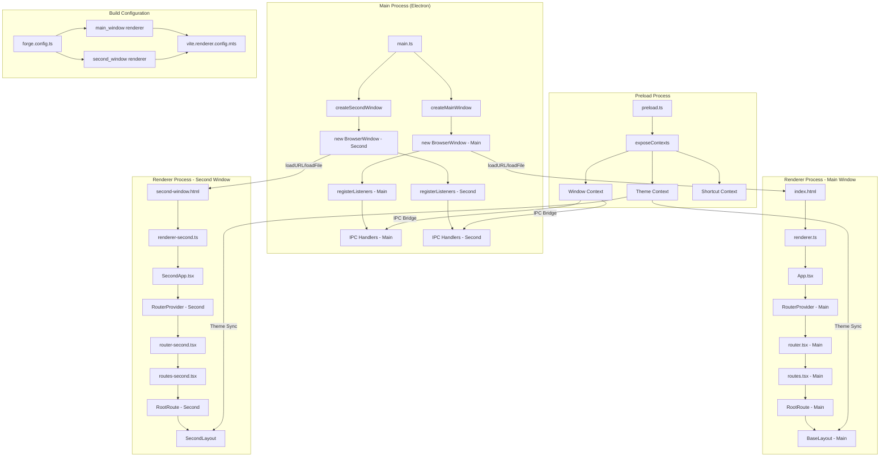

# 多窗口架构设计

本文档描述了如何在 Electron 应用中实现独立窗口架构，包括窗口创建、路由管理和样式隔离。

## 整体架构

Electron 应用由主进程和渲染进程组成：

- **主进程（Main Process）**：负责创建窗口、管理应用生命周期和系统交互
- **预加载脚本（Preload Process）**：提供安全的 IPC 通信桥接
- **渲染进程（Renderer Process）**：负责 UI 渲染和用户交互

在多窗口架构中，每个窗口都有自己的渲染进程，但共享同一个主进程。

## 流程图

以下流程图展示了多窗口架构的组件和它们之间的关系：



## 实现步骤

### 1. 构建配置

在 `forge.config.ts` 中配置多个渲染器：

```typescript
renderer: [
  {
    name: "main_window",
    config: "vite.renderer.config.mts",
  },
  {
    name: "second_window",
    config: "vite.renderer.config.mts", // 可以复用相同的 Vite 配置
  },
],
```

### 2. 入口点设置

每个窗口需要单独的 HTML 入口点和渲染器入口：

- 主窗口：`index.html` → `renderer.ts` → `App.tsx`
- 第二窗口：`second-window.html` → `renderer-second.ts` → `SecondApp.tsx`

### 3. 路由配置

使用 TanStack Router 的内存历史（Memory History）为每个窗口创建独立的路由系统：

- 主窗口：`router.tsx` → `routes.tsx` → `RootRoute`
- 第二窗口：`second-router.tsx` → `second-routes.tsx` → `SecondRootRoute`

### 4. 样式隔离

可以通过以下方式实现不同窗口的样式隔离：

- 使用不同的布局组件（`BaseLayout` vs `SecondWindowLayout`）
- 窗口特定的 CSS 文件
- CSS 命名空间或 Tailwind 前缀
- CSS 变量用于主题切换

### 5. IPC 通信

通过预加载脚本暴露的 IPC 方法实现窗口间通信：

- 通用消息：两个窗口共享相同的 IPC 通道
- 窗口特定消息：使用窗口 ID 或专用通道区分消息目标

## 窗口生命周期管理

### 创建窗口

在主进程中定义窗口创建函数，可以在以下时机调用：

- 应用启动时（自动创建主窗口）
- 用户操作触发（点击按钮打开新窗口）
- IPC 消息响应（从其他窗口发送的打开请求）

### 窗口引用管理

在主进程中保存窗口引用：

```typescript
let mainWindow: BrowserWindow | null = null;
let secondWindow: BrowserWindow | null = null;
```

### 窗口关闭处理

处理窗口关闭事件，清理引用：

```typescript
secondWindow.on("closed", () => {
  secondWindow = null;
});
```

## 注意事项

1. **内存管理**：确保在窗口关闭时清理相关资源和事件监听器
2. **共享状态**：多窗口间的状态共享可通过 IPC、localStorage 或 Electron Store 实现
3. **开发模式**：确保开发模式下多个窗口的热重载正常工作
4. **打包配置**：确保所有窗口资源都被正确打包

## 参考资源

- [Electron 多窗口官方文档](https://www.electronjs.org/docs/latest/api/browser-window)
- [TanStack Router 文档](https://tanstack.com/router/latest) 