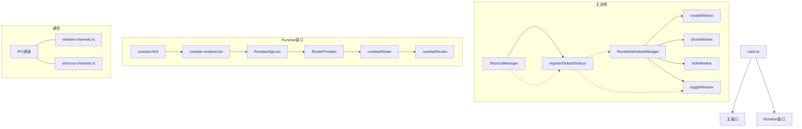

# Runebar 独立窗口实现指南

本文档详细说明了 Runebar 独立窗口的实现方式，包括窗口管理、快捷键支持、UI 设计和与主窗口的通信。

## 架构概述

Runebar 独立窗口采用了与主窗口分离的架构，具有以下特点：

- 独立的窗口进程和生命周期管理
- 专用的 HTML 入口点和渲染器
- 独立的路由系统
- 通过 IPC 与主窗口通信
- 全局快捷键支持



## 关键组件

### 1. RunebarWindowManager

`RunebarWindowManager` 类负责管理 Runebar 窗口的生命周期，包括创建、显示、隐藏和销毁窗口。它使用单例模式确保整个应用中只有一个 Runebar 窗口实例。

主要功能：
- 创建透明且无边框的窗口
- 管理窗口的显示和隐藏
- 在一段时间不使用后销毁窗口以节省内存
- 提供窗口切换功能

### 2. 全局快捷键

使用 `ShortcutManager` 注册全局快捷键 (Alt+Space)，用于显示/隐藏 Runebar 窗口。

### 3. 独立的 UI 和路由

Runebar 窗口拥有自己的 UI 和路由系统：
- `RunebarApp.tsx` - 应用入口点
- `runebar/router.tsx` - 独立的路由器
- `runebar/routes.tsx` - 路由定义
- `runebar/__root.tsx` - 根路由

### 4. 窗口通信

通过 IPC 通道实现窗口间通信：
- 主题同步
- 窗口状态通知
- 命令执行

## 配置详解

### window-config.ts

```typescript
export const RUNEBAR_WINDOW_CONFIG = {
  WIDTH: 600,
  HEIGHT: 400,
  POSITION_Y: 100,
  MEMORY_SAVE_DELAY: 60000,
  TRANSPARENT_BG: "#00000000",
}
```

### forge.config.ts

```typescript
renderer: [
  {
    name: "main_window",
    config: "vite.renderer.config.mts",
  },
  {
    name: "runebar_window",
    config: "vite.renderer.config.mts",
  },
],
```

## 使用方法

### 启动和隐藏

Runebar 窗口可以通过以下方式启动：
1. 按下全局快捷键 `Alt+Space`
2. 通过 IPC 消息触发 `window:toggle-runebar`

窗口会在失去焦点时自动隐藏，也可以通过再次按下快捷键手动隐藏。

### 自定义配置

可以通过修改 `window-config.ts` 文件来自定义 Runebar 窗口的外观和行为：
- 调整窗口尺寸
- 更改位置
- 修改内存节省超时
- 自定义背景透明度

## 注意事项

1. **内存管理**：Runebar 窗口在隐藏一段时间后会被销毁以节省内存，再次需要时会重新创建
2. **透明度**：窗口使用透明背景，但 UI 元素本身有背景色
3. **热重载**：在开发模式下支持热重载
4. **调试**：在开发模式下可以访问开发者工具

## 故障排除

如果 Runebar 窗口无法显示或行为异常，请检查：

1. 确保 HTML 文件中的 CSP 策略正确配置
2. 检查 `runebar.html` 是否正确加载 `runebar-renderer.tsx`
3. 验证全局快捷键注册是否成功
4. 检查控制台是否有错误信息 