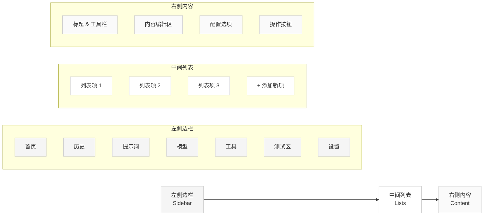
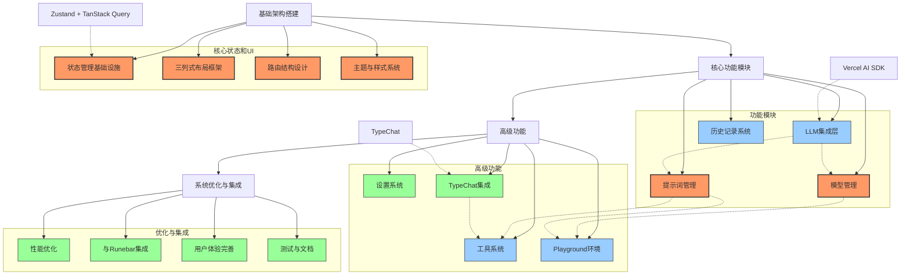

# Runebar Main界面实现计划

## 项目概述

Runebar项目分为两个独立但互补的界面：

1. **Runebar界面** - 快速访问层，使用cmdk提供指令式交互体验，通过全局快捷键激活
2. **Main界面** - 深度功能层，提供完整的配置和管理功能

本文档重点描述Main界面的功能构建计划。

## 功能模块概述

Main界面包含以下主要功能模块：

1. **History (交互历史)**
   - 存储和管理用户与LLM的交互历史
   - 支持搜索、筛选和重用历史记录
   - 提供历史数据的分析和导出功能

2. **Tools (工具构建)**
   - 基于LLM的工具链构建系统
   - 支持组合多个工具形成工作流
   - 提供工具测试和性能分析功能

3. **Prompt (提示词管理)**
   - 提示词创建、编辑和版本控制
   - 提示词模板和变量系统
   - 提示词分类和标签管理

4. **Models (模型配置)**
   - 多模型支持与管理
   - 模型参数配置
   - 性能和成本监控

5. **Playground (测试环境)**
   - 提示词和模型测试环境
   - 结果比较和分析功能
   - 与Tools和Prompt模块集成

6. **Settings (用户设置)**
   - 用户偏好配置
   - 数据导入/导出
   - 高级选项设置

## 技术栈选择

### 状态管理
- **Zustand** - 轻量级状态管理库，用于管理全局UI状态、用户设置和功能状态
- **TanStack Query** - 用于服务器状态管理、数据获取和缓存

### LLM集成
- **Vercel AI SDK** - 提供统一的API接口连接多种LLM模型
- **TypeChat** - 用于结构化输入输出处理

### UI框架
- **React** - 前端UI框架
- **Tailwind CSS** - 样式设计
- **shadcn/ui** - 基于Radix UI的组件库

### 路由管理
- **TanStack Router** - 处理应用路由

## 界面设计

Main界面采用三列式布局：

1. **左侧边栏 (Sidebar)** - 主要功能导航
2. **中间列表 (Lists)** - 可增加的列表，展示和存储多个项目
3. **右侧内容 (Content)** - 详细配置和内容展示区域

这种布局设计有利于多层次信息的组织和展示，同时提供良好的用户体验。

下图展示了三列式布局的界面结构：

## 实现路径图示

下图展示了Main界面功能的实现路径和模块间的依赖关系：

## 实现路径

### 第一阶段：基础架构搭建

1. **状态管理基础设施**
   - 引入Zustand，创建核心store
   - 设计基础状态结构（用户设置、UI状态等）
   - 实现持久化机制（localStorage或IndexedDB）

2. **三列式布局框架**
   - 基于现有sidebar组件实现左侧导航
   - 构建中间列表视图组件
   - 构建右侧内容视图组件
   - 实现响应式布局适配

3. **路由结构设计**
   - 基于现有TanStack Router扩展路由配置
   - 设计嵌套路由结构（功能区域/列表项/详情）
   - 实现路由参数传递机制

4. **主题与样式系统优化**
   - 扩展现有主题系统
   - 统一组件样式规范
   - 构建通用UI组件（卡片、标签、按钮组等）

### 第二阶段：核心功能模块

5. **LLM集成层**
   - 集成Vercel AI SDK
   - 构建模型接口抽象层
   - 实现流式响应处理
   - 添加错误处理和重试机制

6. **模型管理（Models）**
   - 创建模型配置存储
   - 构建模型配置UI
   - 实现模型测试功能
   - 添加模型使用统计

7. **提示词管理（Prompts）**
   - 设计提示词存储结构
   - 构建提示词编辑器
   - 实现提示词版本控制
   - 添加提示词分类和标签系统

8. **历史记录系统（History）**
   - 设计历史记录数据结构
   - 实现历史记录存储和检索
   - 构建历史浏览和搜索UI
   - 添加历史记录导出功能

### 第三阶段：高级功能

9. **工具系统（Tools）**
   - 设计工具定义结构
   - 实现工具编辑器
   - 构建工具执行引擎
   - 添加工具调用历史和分析

10. **Playground环境**
    - 整合模型和提示词测试环境
    - 实现结果比较功能
    - 添加性能和成本分析
    - 构建变量测试功能

11. **设置系统（Settings）**
    - 实现用户偏好设置
    - 添加数据导入/导出
    - 实现快捷键配置
    - 添加高级设置选项

12. **TypeChat集成**
    - 实现结构化输出处理
    - 构建类型定义编辑器
    - 添加类型验证和修复功能
    - 与工具系统集成

### 第四阶段：系统优化与集成

13. **性能优化**
    - 组件渲染优化
    - 状态管理优化
    - 数据加载策略优化
    - 实现虚拟滚动等技术

14. **与Runebar集成**
    - 设计Main和Runebar通信机制
    - 实现快捷命令定义
    - 添加深层链接功能
    - 构建上下文共享机制

15. **用户体验完善**
    - 添加引导和帮助系统
    - 实现通知和提醒功能
    - 优化错误和异常处理
    - 添加用户反馈机制

16. **测试与文档**
    - 编写单元测试和集成测试
    - 完善开发文档
    - 创建用户使用文档
    - 实现自动化测试流程

## 推荐实施顺序

为了高效地实现上述功能，建议按照以下顺序推进：

1. 首先完成基础架构搭建（阶段一）
2. 然后实现Models和Prompts两个核心模块（阶段二部分）
3. 接着构建History系统
4. 再开发Tools和Playground环境
5. 最后完成Settings和系统优化

这种渐进式的实现路径可以确保始终有可用的功能，同时系统结构能够稳步发展。

## 技术挑战与解决方案

### 状态管理复杂性
- **挑战**：需要管理多种类型的状态（UI状态、模型配置、历史记录等）
- **解决方案**：使用Zustand创建多个专用store，保持关注点分离

### 异步操作处理
- **挑战**：LLM API调用和流式响应处理
- **解决方案**：利用Vercel AI SDK的流式响应支持，结合TanStack Query的数据获取能力

### 数据持久化
- **挑战**：大量历史数据和配置需要持久化存储
- **解决方案**：结合localStorage和IndexedDB，对大型数据使用IndexedDB

### UI一致性
- **挑战**：保持复杂界面的一致性和可用性
- **解决方案**：构建可复用的组件库，确立清晰的设计规范

## 结论

通过这种分阶段、模块化的实现方式，可以系统性地构建出功能完备的Main界面，为用户提供强大的AI工具管理和使用体验。同时，这种设计充分利用了现有项目架构和技术栈，确保新功能与现有系统的无缝集成。 